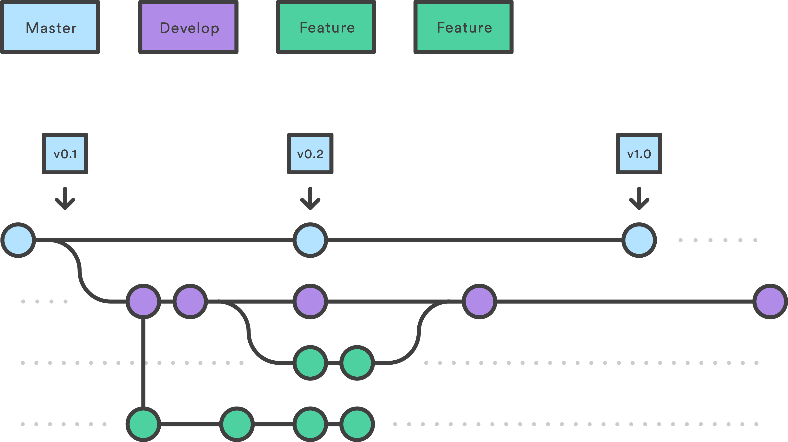

# java-hello-world simple REST application

This application is used to demonstrate the CI/CD workflow using GitHub Actions as well as its operation in Kubernetes environment using GitOps tecniques.

## Start the application with Docker

```
docker run \
    -ti \
    --rm \
    -p 8080:8080 \
    -e ENVIRONMENT=local \
    -e VERSION=latest \
    dennydgl1/java-hello-world:latest
```

## Query the API

```console
$ curl http://localhost/greet | jq .
{
  "message": "Hello World v.latest from host 59dfb6b554xbjj7! I'm running in local!"
}
```

## Branching strategy

Please use the "Feature Branch" branching strategy to develop this application:



Every time a tag is pushed to origin, a CI/CD workflow starts to:

- build sources (Maven)
- test the application (JUnit)
- package the application (Maven)
- build the image (Docker)
- push the image (Docker Hub)


